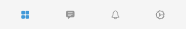

[](https://github.com/LenisDev/TabBar/blob/master/LICENSE)
[](https://github.com/LenisDev/TabBar/releases)


- [Overview](#overview)
- [Usage](#usage)
- [Installation Guide](#installation-guide)
- [Full Documentation](https://lenisdev.github.io/TabBar/index.html)
- [Contribute](#contribute)

<br>

### Overview
Leight-weight, reusable and heighly customizable tab bar.

- Simple icons



- Selected with Border style


- Selected with Circle style


- Text with capsule style


- Text and Icon


- Text and Icon with capsule style


Checkout [Example Project](https://github.com/LenisDev/TabBar/tree/master/Examples/TabBarExamples/TabBarExamples)
<br>

### Usage
```swift
  
  // Step 1: Create Data for tab bar   
  let tabItems = [TabBarItemViewModel(id: UUID().description, title: "Tab 1", image: UIImage(systemName: "trash"), state: .selected),
                  TabBarItemViewModel(id: UUID().description, title: "Tab 2", image: nil)]
                  
  // Step 2: Create tab bar
  let tabView = TabBarView(data: TabBarViewModel(items: tabItems)) { [weak self] (selectedItem) in // always use weak to avoid reference cycle
    // on item selected
    print(selectedItem)
  }
  
  // Step 3: Customize (optional)  
  tabView
    // apply style on tabView (tab items are placed inside this view)
    .style(RectStyle())
    // apply styles on tab item
    .itemUnselectedStyle(RectStyle())
    .itemSelectedStyle(CapsuleBorderStyle())
  
```

<br>

### Installation Guide

#### Carthage

Step 1: 
Add following to your CartFile

```
github "LenisDev/TabBar" ~> 0.0.2
```

Step 2:
run `carthage update` from current project directory.

*That's all, you have it installed.*

<br>

#### CocoaPods

Step 1:
Add `pod 'Tab', '~> 0.0.2'` to your Podfile:

```
target 'MyApp' do
  pod 'Tab', '~> 0.0.2'
end
```

Step 2:
run `pod install` from current project directory.

*That's all, you have it installed.*

<br>

>
>
>Try it using following command
>```
>pod try Tab
>```
>

<br>

#### Swift Package Manager
```
dependencies: [
    .package(url: "https://github.com/LenisDev/TabBar.git", .upToNextMajor(from: "0.0.2"))
]
```

<br>

### Contribute
> - Play around and report bugs
> - Fix issues and create PR
> - Add documentations and new features
